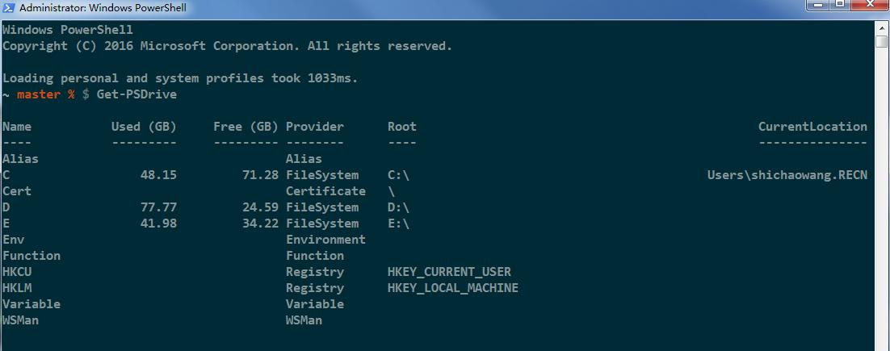
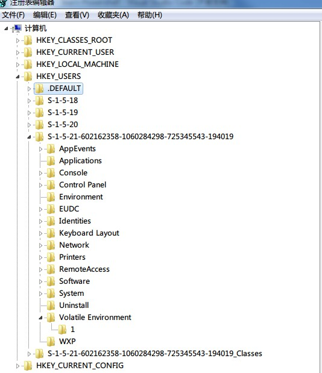

## Chapter04

1. 提供程序（PSProvider）本质是是一个适配器，既可以是文件系统，也可以是注册表
> 下图即是本机的get-drive的结果



2. `get-command`的使用
``` powershell
    get-command -noun *item* //查询包含item的cmdlet

```

3. 文件系统的结构
    1. 文件系统是一个三层结构，分别是磁盘驱动器，文件夹，文件
    2. 其中文件夹是一种容器，可以包含其他文件夹或者文件
    3. 文件是最小单位的对象

4. 注册表采用与文件系统相似的结构，但是注册表是项-子项-键值的顺序来表现


5. 查看Alias
    1. `get-alias -name *man*`

### 动手实验
1. 定位至HKCU\software\microsoft\windows\currentversion\explorer并将advanced下的dontprettypath的值修改为0
``` powershell
    set-location -path hkcu:\software\microsoft\windows\currentversion\explorer
    set-itemProperty -path .\advanced -name dontprettypath -value 0

```
2. 创建空文件c:\test.txt
``` powershell
    new-item -path c:\test.txt
```

3. 尝试使用set-item修改test.txt的内容
``` powershell
    set-item -path c:\test.txt -value testing
    //出错了，截图见下方
```


4. `get-childitem`的`-filter`,`-include`,`-exclude`参数之间有什么不同？
    1. `include`是指匹配某个模式，可以使用通配符或者具体的文件
        `get-childitem -path c:\ -include *.txt`
    2. `exclude`是排除某种模式，可以使用使用通配符或者指定某个文件
        `get-childitem -path c:\ -exclude *.txt`
    3. `filter`某些时候和`include`的功能相似，也可以配合`include`和`exclude`一起使用
